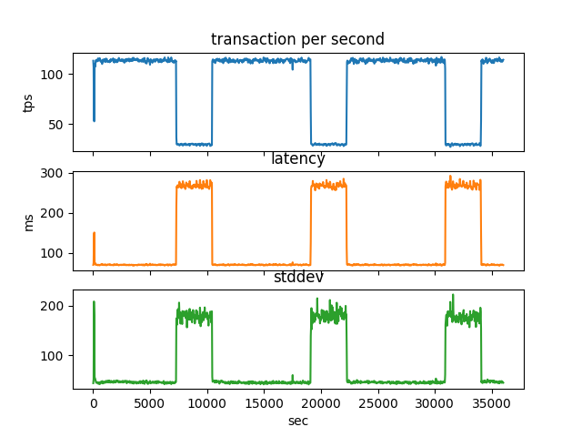
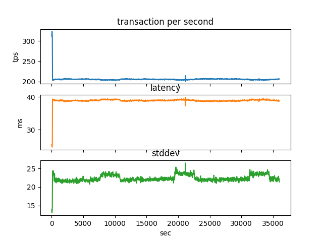
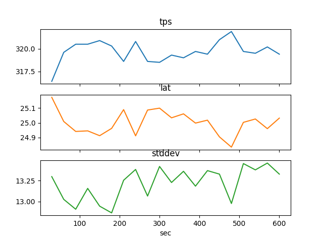
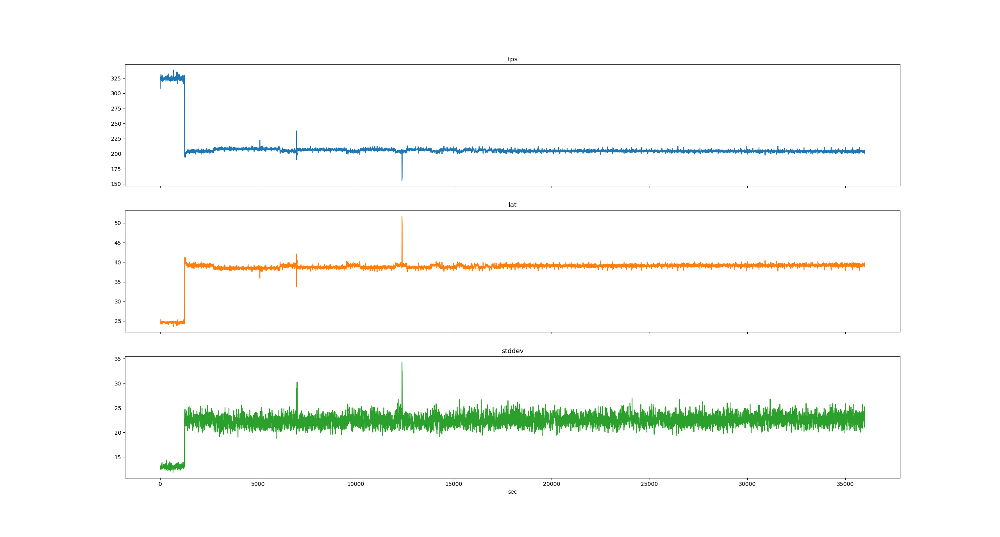

# <a name="locks"></a> Locks

1. [Locks](#locks)
    - [#1](#1)
    - [#2](#2)
    - [#3](#3)
    - [#4](#4)
2. [Auto vacuum](#autovacuum)

## <a name="1"></a> #1

- `postgressql.conf`

```shell
deadlock_timeout = 200ms
log_lock_waits = on 
log_statement = 'all'   
```

```sql
create table cars
(
    id   int generated by default as identity,
    vin  varchar(16) not null default left(md5(random()::text), 16),
    mark varchar(32),
    cost numeric     not null default 0,
    year date        not null
);
insert into cars(mark, cost, year)
values ('Volkswagen Tiguan', 2375000, '2021-01-01'),
       ('Volkswagen Polo', 1375000, '2021-01-01'),
       ('Volkswagen Touareg', 1399000, '2011-01-01');
```

| id  | vin              | mark               | cost    | year       |
|-----|------------------|--------------------|---------|------------|
| 1   | 9ceff16be913f232 | Volkswagen Tiguan  | 2375000 | 2021-01-01 |
| 2   | 23046f92e4afb82c | Volkswagen Touareg | 1399000 | 2011-01-01 |

Session #1

```sql
begin;
update cars
set cost = 2000000
where id = (select id from cars order by id desc limit 1);
```

Session #2

```sql
begin;
create index on cars (vin);
```

Session #3

```shell
cat /var/log/postgresql/postgresql-12-main.log | tail -n 20
```

```
2022-02-20 14:52:58.214 MSK [3153] postgres@hw3 LOG:  statement: begin;
2022-02-20 14:52:58.214 MSK [3153] postgres@hw3 LOG:  duration: 0.250 ms
2022-02-20 14:53:02.193 MSK [3153] postgres@hw3 LOG:  statement: update cars set cost = 2000000 where id = (select id from cars order by id desc  limit 1);
2022-02-20 14:53:02.197 MSK [3153] postgres@hw3 LOG:  duration: 3.507 ms
2022-02-20 14:53:09.019 MSK [3164] postgres@hw3 LOG:  statement: begin;
2022-02-20 14:53:09.019 MSK [3164] postgres@hw3 LOG:  duration: 0.240 ms
2022-02-20 14:53:13.160 MSK [3164] postgres@hw3 LOG:  statement: create index on cars(vin);
2022-02-20 14:53:13.361 MSK [3164] postgres@hw3 LOG:  process 3164 still waiting for ShareLock on relation 16433 of database 16410 after 200.345 ms
2022-02-20 14:53:13.361 MSK [3164] postgres@hw3 DETAIL:  Process holding the lock: 3153. Wait queue: 3164.
2022-02-20 14:53:13.361 MSK [3164] postgres@hw3 STATEMENT:  create index on cars(vin);
```

---

## <a name="2"></a> #2

Session #1

```sql
begin;
select txid_current();
txid_current 
--------------
          592
update cars
set cost = cost + 1000000
where id = 2;
```

Session #2

```sql
begin;
select txid_current();
txid_current 
--------------
          593
update cars
set cost = cost + 2000000
where id = 2;
```

Session #3

```sql
begin;
select txid_current();
txid_current 
--------------
          594
update cars
set cost = cost + 3000000
where id = 2;
```

```sql
select mode, pid, locktype, granted, transactionid, pg_blocking_pids(pid)
from pg_locks
where locktype in ('relation', 'transactionid', 'tuple')
  and (locktype != 'relation' or relation = 'cars'::regclass)
order by pid;
```

- **592** takes `row exclusive` table for row _update_ and `for share` row lock for _select_

| mode             | pid  | locktype      | granted | transactionid | pg\_blocking\_pids |
|:-----------------|:-----|:--------------|:--------|:--------------|:-------------------|
| ExclusiveLock    | 3153 | transactionid | true    | 592           |                    |
| RowExclusiveLock | 3153 | relation      | true    | NULL          |                    |

- **593** takes `row exclusive` table lock for _update_ on version of row changed by **592**, awaits `for share` lock
  and sleep

| mode             | pid  | locktype      | granted | transactionid | pg\_blocking\_pids |
|:-----------------|:-----|:--------------|:--------|:--------------|:-------------------|
| ExclusiveLock    | 3164 | tuple         | true    | NULL          | {3153}             |
| ShareLock        | 3164 | transactionid | false   | 592           | {3153}             |
| RowExclusiveLock | 3164 | relation      | true    | NULL          | {3153}             |
| ExclusiveLock    | 3164 | transactionid | true    | 593           | {3153}             |

- **594** takes `row exclusive` table lock for _update_ on uncommited version of row from **593** and sleep

| mode             | pid  | locktype      | granted | transactionid | pg\_blocking\_pids |
|:-----------------|:-----|:--------------|:--------|:--------------|:-------------------|
| ExclusiveLock    | 3385 | tuple         | false   | NULL          | {3164}             |
| ExclusiveLock    | 3385 | transactionid | true    | 594           | {3164}             |
| RowExclusiveLock | 3385 | relation      | true    | NULL          | {3164}             |

---

## <a name="3"></a> #3

---

## <a name="4"></a> #4

---

# <a name="autovacuum"></a> Auto vacuum

Run pgbench on other host

```shell
python3 bench.py
```

## Default postgres



## Autovacuum Off



---

Setup autovauum

- `postgressql.conf`

```shell
autovacuum = on 
log_autovacuum_min_duration = 0
autovacuum_max_workers = 10
autovacuum_naptime = 5s
autovacuum_vacuum_scale_factor = 0.01 
autovacuum_analyze_scale_factor = 0.01 
autovacuum_vacuum_cost_delay = 1ms  

max_connections = 40
shared_buffers = 4GB
effective_cache_size = 4GB
maintenance_work_mem = 4GB
checkpoint_completion_target= 0.9
wal_buffers = 128MB
default_statistics_target = 500
effective_io_concurrency = 100
work_mem = 1GB
min_wal_size = 4GB
max_wal_size = 16GB
```

## 600s benchmark



## 10h benchmark



```shell
sudo iotop -aoP
```

```shell
Total DISK READ:         0.00 B/s | Total DISK WRITE:      1263.80 K/s
Current DISK READ:       0.00 B/s | Current DISK WRITE:    1153.91 K/s
```
